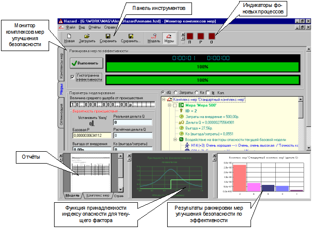
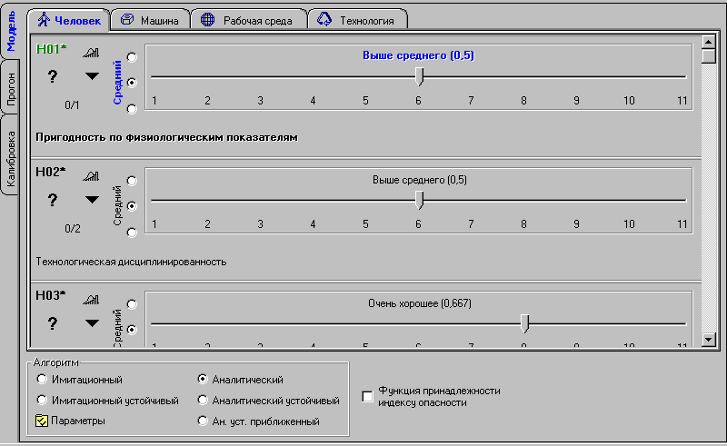
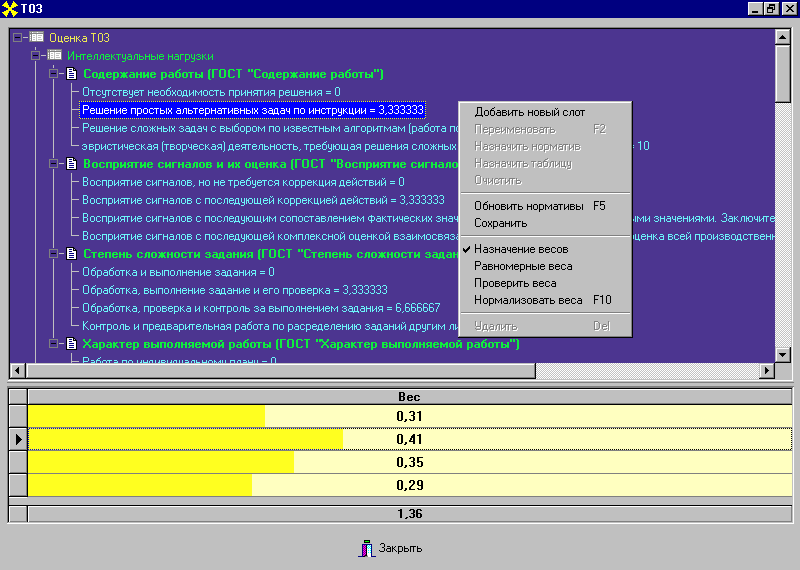
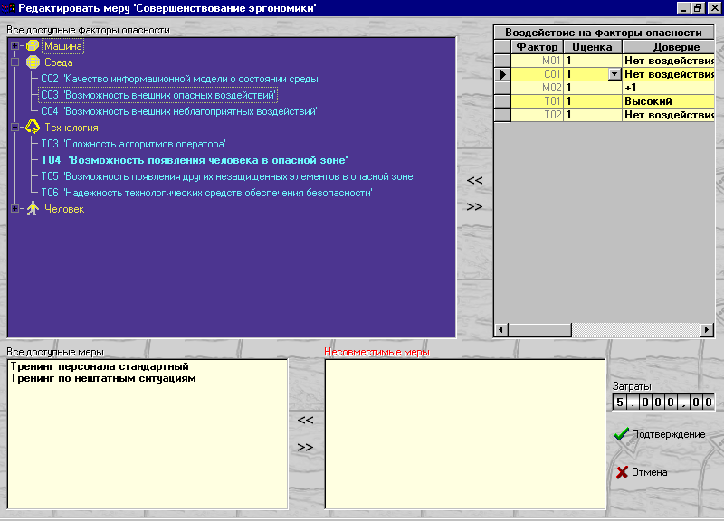
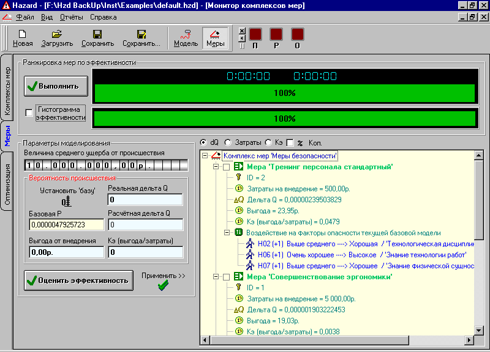

## Hazard - система аналитического моделирования опасных производственных объектов при помощи сетей GERT



>[Полная документация](./Doc/Alhorithms3.doc)<br/>
[Исполняемые файлы Win32](https://github.com/alexf2/Hazard/releases/download/Release1/Hzd_Inst.rar)

## О проекте
Представляет из себя настольное приложение на Visual Basic 6, позволяющее описывать структуру опасного объекта в виде сети GERT и вычислять оценки фактора риска для каждого узла. В основе системы лежит движок на основе COM-объектов, реализованных на Visual C++ / ATL, и имеется система плагинов для оценки факторов опасности. Каждый плагин представляет из себя COM-объект. Также, имеется фасад системы в виде COM-объекта для интеграции в Mathcad.

## Общие сведения
Используемая шкала оценок значений факторов опасности слишком велика (11 баллов) для того, чтобы оценки легко устанавливались вручную. Поэтому существенной частью системы является компонент автоматизации их вычисления (см. рис. 5.1). Для этого предложена и реализована специальная методика, изложенная в следующем пункте. Оказалось, что множество выявленных факторов опасности пересекается с факторами, используемыми инженерами по технике безопасности. Отсюда вытекает существенное преимущество разработанной модели, выражающееся в том, что методики оценки условий, гигиены и безопасности труда, относительно легко могут быть адаптированы для нашего множества факторов опасности. Важно, что существующие методики позволяют на основе ГОСТов, нормативных актов и документации на ОПО, определить различные количественные характеристики объекта, реализуя их преобразование в универсальные шкалы (выставление балльных оценок). Существенны само наличие и апробированность этих методик, упрощающие весьма трудоёмкий процесс разработки методики вычисления оценок.
Предлагаемая методика может быть использована во многих случаях, но не всегда, и не каждого эксперта этот подход удовлетворит. Поэтому требуется большая гибкость.
Для чего и была разработана архитектура, основанная на реализации модуля оценок в виде внешнего, по отношению к Hazard, компонента. Чтобы обеспечить такую гибкость, необходимо предоставить пользователю (обычно эксперту) возможность реализовывать собственные алгоритмы оценки значений и пользоваться собственными структурами и базами данных. Поскольку тип связи между таким модулем и системой Hazard, - простой, то не целесообразно утяжелять продукт с помощью Visual Basic for Applications. Специфика же разработки таких алгоритмов определена необходимостью работы со сложными структурами данных. Поэтому Hosting script так же мало подходит и неоправданно утяжеляет продукт, так как спроектирован для реализации алгоритмов управления объектами, а не обработки структурированных данных.
Оптимальной здесь является концепция модулей расширения (plugins), что и было реализовано, используя технологию COM. Такие модули обычно весьма компактны (имеют малый размер, малую зависимость от различных библиотек и компонент,  мало потребляют ресурсов). Могут быть реализованы на любом языке, для которого есть инструментальное средство, позволяющее осуществлять разработку компонент по технологии COM. Это даёт большую гибкость реализации, но, само по себе, не вносит существенного технологического усложнения в задачу. Трудоёмкость и сложность существенно возрастают при реализации данного компонента на низкоуровневых средствах и языках, например, с помощью Visual C++. Однако - как доступный неквалифицированным программистам, наименее трудоёмкий и весьма эффективный способ, предлагается реализация на Visual Basic. Тип связи с Hazard очень прост и от компонента требуется только, чтобы он был внутрипроцессным COM-сервером, реализующим интерфейс IFactorAssign и умеющим  выполнять роль COM-клиента, использующего интерфейс IDispatch и дуальный интерфейс MGertNet. Создание таких COM-объектов, реализованных внутрипроцессным COM-сервером, с помощью Visual Basic 6 тривиально, и легко выполняется неквалифицированными программистами, так как - существенно автоматизировано.
Сформулированная суть разработки расширения, определяет содержание спецификации на него. Чтобы компонент был распознан Hazard, подключён и мог взаимодействовать с ним, требуется:

* реализовать расширение в виде COM-компонента, поддерживаемого ActiveX DLL;
* реализовать интерфейс IFactorAssign;
* реализовать IDispatch (или дуальный интерфейс), через который может быть запрошен IFactorAssign;
* импортировать библиотеку типов GertNet.tlb;
* регистрируя компонент отметить его CLSID, как описывающий категорию CATID_FacValMonitors (“Модули экспертной оценки значений факторов опасности”). 

В качестве примера, было реализовано универсальное расширение (на Visual Basic 6), являющееся весьма сложным продуктом и реализующее методику средневзвешенного. Реализованный модуль оценки методом средневзвешенного - универсален, поэтому использует изощрённый графический интерфейс, сложные динамические структуры данных и редакторы для них, что позволяет эффективно описывать широкий круг ОПО. Поэтому он не является типовым примером. Однако, как было уже указано, все эти сложности не относятся к механизму взаимодействия с Hazard, а являются особенностями данной реализации, определёнными требованиями к нему (как к универсальному коммерческому продукту). Для частных случаев (служебного пользования) предлагается создавать простые модули со статической структурой, которые могут эффективно разрабатываться неквалифицированными программистами с помощью Visual Basic.

## Архитектура
Hazard выполнен как внепроцессный COM-сервер (ActiveX EXE) с помощью Visual Basic 6 и представлен COM-классом Hazard.HazardApp. Ядро Hazard, содержащее коды модели развития происшествия на ОПО, коды алгоритмов прогона модели и оптимизации, выполнено как внутрипроцессный COM-сервер (ActiveX DLL), с помощью Visual C++ 6.0 (ATL) и представлено COM-классом GERTNETLib.MGertNet.
Hazard может быть использован клиентами OLE Automation, для чего предоставляет возможность создавать свои экземпляры путём создания Hazard.HazardApp. Класс HazardApp имеет ряд открытых (public) свойств и методов, дающих ограниченный доступ к возможностям Hazard, для чего реализована специальная прослойка (правда, достаточно “сырая”), учитывающая особенности работы в режиме сервера OLE автоматизации. Прослойка обеспечивает не  только правильное выполнение функций, но и доступ к ядру Hazard. Последнее может быть использовано и напрямую - путём создания экземпляра MGertNet без запуска Hazard. Большая часть интерфейсов и классов библиотеки GERTNETLib являются открытыми и создаваемыми (public, creatable), однако их реализация в существенной части накладывает ограничения на реализацию описанных там интерфейсов, так как осуществляется расширяющее преобразование указателей на интерфейсы к типам реализующих объектов C++. Поэтому прямое использование ядра Hazard должно производиться в соответствии со строгими правилами:
**Создание экземпляра Hazard:**
```Basic
Dim m_haApp As HazardApp
Set m_haApp = CreateObject("Hazard.HazardApp")
```
Для уведомления клиентов о ходе асинхронных операций, HazardApp и MGertNet предоставляют точку соединения (connection point) для стока с интерфейсом ICallBack.
Рассмотрим объекты, включаемые экземпляром приложения HazardApp.
**GertNetMain** (только чтение) – модель развития происшествия. Если модели нет (не загружалась и не создавалась новая), то пустая (Nothing).
**GertNetMainDsp** (только чтение) – интерфейс IDispatch модели развития происшествия. Если модели нет (не загружалась и не создавалась новая), то пустая (Nothing).

**GN_Opt** (только чтение) – копия модели, используемая для оптимизации. Установлено только во время выполнения оптимизации.

**GN_Rang** (только чтение) – копия модели, используемая для ранжировки. Установлено только во время выполнения ранжировки.

**GN_Run** (только чтение) – копия модели, используемая при прогоне. Установлено только во время выполнения прогона.

**Rep1** (только чтение) – коллекция отчётов по модели (прогоны, модель).

**Rep2** (только чтение) – коллекция отчётов по комплексам мероприятий (оптимизация, комплексы, пробное применение наборов мер).

**XCollection** (только чтение) – коллекция комплексов мероприятий улучшения безопасности. Каждый комплекс описывается коллекцией мероприятий (CollSF). Каждое мероприятие (SafetyPrecaution) содержит коллекцию воздействий (FChange) на модель. Для доступа к комплексам мер, имеется ещё одно открытое (public) свойство: SFnn(n). Оно является индексируемым и только для чтения.

**Enumerators** (только чтение) – коллекция перечислителей.

**Factors** (только чтение) – коллекция факторов опасности. Каждому фактору из этой коллекции назначается перечислитель из коллекции Enumerators.

**OptimizResultsGetAndClear** (только чтение) – SAFEARRAY(IDispatch). Используется после выполнения оптимизации. При вызове этого свойства, возвращается массив указателей на интерфейс IDispatch коллекций мероприятий улучшения безопасности ОПО. При этом владельцем коллекций становится вызывающий клиент, а ядро Hazard - освобождает ссылки на них. Поэтому вызывать можно только один раз. Каждая коллекция содержит выборку мероприятий – возможный вариант решения оптимизационной задачи.

<table>
    <tr>
        <td>Редактор модели</td>
        <td>Редактор оценочных таблиц</td>
    </tr>
    <tr>
        <td></td>
        <td></td>
    </tr>
    <tr>
        <td>Редактор мероприятий улучшения безопасности</td>
        <td>Монитор комплексов мер</td>
    </tr>
    <tr>
        <td></td>
        <td></td>
    </tr>
</table>
